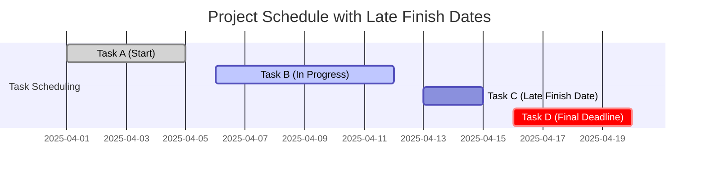

The **Late Finish Date** is the **latest possible time an uncompleted activity can finish without delaying the project completion date**. It is determined using **schedule network logic, project constraints, and the critical path method (CPM)**. Any delay beyond this date will extend the project's overall duration.

### **Key Aspects of Late Finish Date**
- **Determined by Backward Pass Analysis** – Calculated by working backward from the project’s deadline.
- **Essential for Critical Path Analysis** – Helps identify time flexibility for tasks.
- **Influenced by Project Constraints** – Late finish dates adjust based on external deadlines and dependencies.
- **Impacts Schedule Buffering** – Used to assess slack and float availability.

### **Example Scenarios**

#### **Software Development**
- **Scenario:** A testing phase must finish by **April 15** to allow time for final deployment.
- **Late Finish Date:** If testing extends beyond April 15, the launch will be delayed.

#### **Construction Project**
- **Scenario:** Electrical wiring must be completed before final inspections on **July 30**.
- **Late Finish Date:** Any delay in wiring completion will push back final approvals.

#### **Marketing Campaign**
- **Scenario:** A product launch campaign must end before a regulatory deadline.
- **Late Finish Date:** The campaign’s last promotional activities cannot extend past the compliance cut-off.

### **Mermaid Diagram: Late Finish Date in Scheduling**

## Why Late Finish Date Matters

- Prevents Project Delays – Ensures activities complete on time to meet deadlines.
- Identifies Schedule Flexibility – Shows how much slack is available before affecting the end date.
- Supports Risk Management – Helps anticipate scheduling risks and constraints.
- Optimizes Resource Allocation – Allows better planning for workforce and material availability.

See also: [[Early Finish Date]], [[Early Start Date]], [[Late Start Date]], [[Schedule Network Analysis]], [[Critical Path Method (CPM)]].