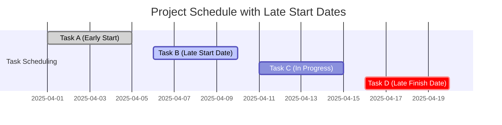

The **Late Start Date** is the **latest possible time an activity can begin without delaying the project's completion**. It is determined using **backward pass analysis in the Critical Path Method (CPM)** and considers **schedule network logic, project deadlines, and constraints**. 

### **Key Aspects of Late Start Date**
- **Calculated Using Backward Pass** – Helps determine how late a task can start while keeping the project on schedule.
- **Directly Tied to Late Finish Date** – If an activity is delayed past its Late Start Date, it pushes its Late Finish Date, affecting the project end.
- **Affects Total Float** – The gap between Early Start and Late Start shows available scheduling flexibility.
- **Essential for Critical Path Analysis** – Helps identify tasks that have no scheduling flexibility.

### **Example Scenarios**

#### **Software Development**
- **Scenario:** UI design must start by **April 10** to avoid delaying development.
- **Late Start Date:** If UI design begins after April 10, backend integration will be pushed back.

#### **Construction Project**
- **Scenario:** Roof installation must start by **July 15** before interior work begins.
- **Late Start Date:** Any delay beyond July 15 will impact the overall project schedule.

#### **Event Planning**
- **Scenario:** Venue selection must begin by **September 1** to allow time for setup.
- **Late Start Date:** Starting after September 1 risks missing the planned event date.

### **Mermaid Diagram: Late Start Date in Scheduling**

## Why Late Start Date Matters

- Prevents Schedule Delays – Ensures work begins in time to meet project deadlines.
- Optimizes Resource Planning – Helps allocate resources efficiently without idle time.
- Affects Project Float – Helps determine how much flexibility is available before delays occur.
- Supports Risk Management – Identifies areas where delays could impact the overall schedule.

See also: [[Early Start Date]], [[Early Finish Date]], [[Late Finish Date]], [[Schedule Network Analysis]], [[Critical Path Method (CPM)]].