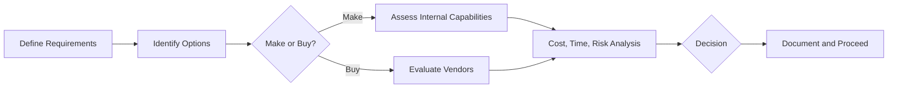

A **Make-or-Buy Analysis** is the structured decision-making process used to determine **whether project deliverables should be produced internally (made) or acquired from external sources (bought)**. It involves collecting data about the product or service requirements and evaluating available alternatives based on cost, capacity, capability, risk, timing, and strategic alignment.

### **Purpose and Use in Projects**

This analysis supports **procurement planning** by identifying the most feasible and cost-effective option for delivering a particular component of the project. It ensures that project teams focus internal resources where they bring the most value, while leveraging external vendors when advantageous.

### **Key Factors Considered**
- **Cost Comparison** – Direct and indirect costs of making versus buying.
- **Resource Availability** – Internal expertise, capacity, and infrastructure.
- **Time Constraints** – Lead time differences between internal development and external procurement.
- **Risk Assessment** – Quality risks, dependency risks, and integration risks.
- **Strategic Fit** – Alignment with long-term organizational capabilities and objectives.

### **When to Apply**
- When introducing a new component or capability into the project.
- When internal resource limitations affect timeline or quality.
- When external vendors offer cost or speed advantages.

### **Example Scenarios**

#### **Software Project**
A team evaluates building a custom authentication system versus integrating a commercial identity provider like Okta. The commercial option offers faster implementation and proven security, making it the preferred "buy" decision.

#### **Construction Project**
A contractor decides between fabricating steel beams in-house or subcontracting to a supplier. The in-house option provides better control, but outsourcing may reduce costs and speed up delivery.

### **Mermaid Diagram: Make-or-Buy Evaluation Flow**

### Why Make-or-Buy Analysis Matters

- Supports Procurement Strategy – Informs whether to contract externally or allocate internal resources.
- Optimizes Cost and Efficiency – Helps select the option with the best value proposition.
- Reduces Project Risk – Identifies capability gaps and supply chain dependencies early.

See also: [[Procurement Management Plan]], [[Cost-Benefit Analysis]], [[Risk Management]], [[Requirements Management Plan]].