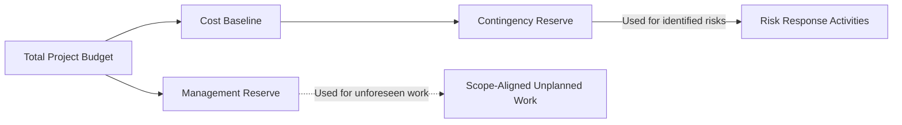

A **Management Reserve** is a specific amount of **time or money set aside by management** beyond the approved project schedule or cost baseline. It is reserved for **unplanned but within-scope work** that may arise during the course of a portfolio, program, or project. Unlike contingency reserves, which are allocated for identified risks, management reserves address **unknown unknowns**—unforeseen issues that were not initially anticipated.

### **Purpose and Characteristics**
- **Scope Bound** – Used only for work that falls within the approved project scope.
- **Controlled Access** – Cannot be used without management approval; usually released after formal evaluation.
- **Not in Baseline** – Excluded from the cost or schedule baseline but included in the total project budget.
- **Supports Agility** – Allows flexibility to adapt to emergent changes or rework.

### **Examples of Use**
- Responding to regulatory changes that introduce new compliance tasks.
- Addressing unexpected technical challenges that require additional testing or redesign.
- Incorporating customer-requested enhancements discovered mid-project, if they fall within original scope intent.

### **Comparison: Management Reserve vs. Contingency Reserve**

| Feature                  | Management Reserve                  | Contingency Reserve                 |
|--------------------------|--------------------------------------|--------------------------------------|
| Purpose                  | Unknown, unforeseen risks            | Known, identified risks              |
| Approval Required        | Yes, management-controlled           | Usually managed by project team      |
| Included in Baseline     | No                                   | Yes                                  |
| Tied to Specific Risks   | No                                   | Yes                                  |

### **Mermaid Diagram: Reserve Allocation Context**

### Why Management Reserve Matters

- Enables Resilience – Helps the organization absorb impacts from unpredictable project shifts.
- Improves Governance – Provides a formal mechanism to handle change within boundaries.
- Separates Planning from Flexibility – Maintains the integrity of the project baseline while preserving adaptability.

See also: [[Contingency Reserve]], [[Project Budget]], [[Risk Management]], [[Cost Baseline]].