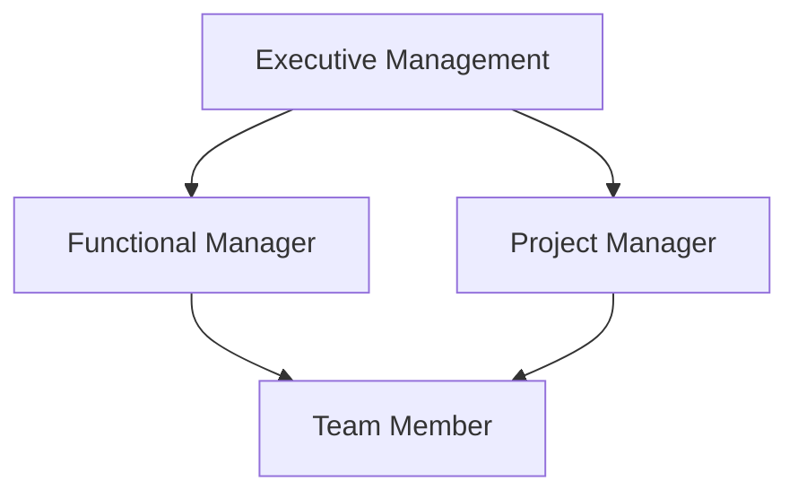

A **Matrix Organization** is an organizational structure where **authority and responsibilities are shared between the project manager and functional managers**. This dual-authority model is used to **optimize resource utilization** across multiple projects without disrupting departmental stability. Team members report to **both a functional manager** for their discipline-specific tasks and a **project manager** for project-related work.

### **Key Characteristics**
- **Shared Authority** – Project managers and functional managers jointly oversee work assignment and resource allocation.
- **Resource Flexibility** – Personnel can be deployed across projects as needed without leaving their functional home.
- **Dual Reporting** – Team members may receive direction from more than one supervisor.
- **Balance of Priorities** – Requires negotiation and communication to balance project and functional demands.

### **Types of Matrix Organizations**
- **Weak Matrix** – Functional manager has more authority; project manager acts more like a coordinator.
- **Balanced Matrix** – Authority is equally shared between project and functional managers.
- **Strong Matrix** – Project manager has greater authority and more control over resources.

### **Example Scenario**
In a software company, a developer reports to the **Engineering Manager** for professional development and performance reviews but works under the **Project Manager** to deliver a specific product feature as part of a release cycle.

### **Mermaid Diagram: Matrix Organization Reporting Lines**

### Why Matrix Organizations Matter

- Increases Efficiency – Leverages specialized resources across multiple initiatives.
- Supports Cross-functional Collaboration – Encourages knowledge-sharing between departments.
- Aligns Strategic and Operational Goals – Helps connect long-term functional goals with short-term project needs.

See also: [[Functional Organization]], [[Projectized Organization]], [[Resource Management]], [[Project Manager]].