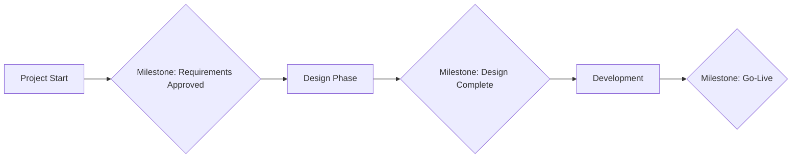

A **Milestone** is a **significant point or event** within a portfolio, program, or project that marks the completion of a major phase, deliverable, or decision point. Milestones are **zero-duration markers** used to track progress, validate alignment with objectives, and support stakeholder communication.

### **Characteristics of Milestones**
- **No Duration** – Represent moments in time, not tasks with effort or length.
- **Tied to Deliverables** – Often linked to the completion of key outputs or approvals.
- **Used for Tracking** – Provide high-level indicators of project health and schedule alignment.
- **Decision-Driven** – May signal go/no-go decisions or the start of a new phase.

### **Examples of Common Milestones**
- Project charter approved
- Completion of design phase
- Product prototype delivered
- Stakeholder sign-off received
- Go-live date reached

### **Use in Scheduling**
Milestones are included in project schedules to:
- Mark dependencies between major activities
- Highlight contractual or regulatory deadlines
- Communicate key events to stakeholders
- Provide anchor points for progress assessments

### **Mermaid Diagram: Sample Milestones in a Project Timeline**

### Why Milestones Matter

- Aid Communication – Offer clear reference points for progress reporting.
- Enhance Visibility – Help stakeholders understand project status at a glance.
- Support Governance – Used as checkpoints in phase gates or steering committee reviews.

See also: [[Project Schedule]], [[Deliverable]], [[Milestone Schedule]], [[Project Phase]].

