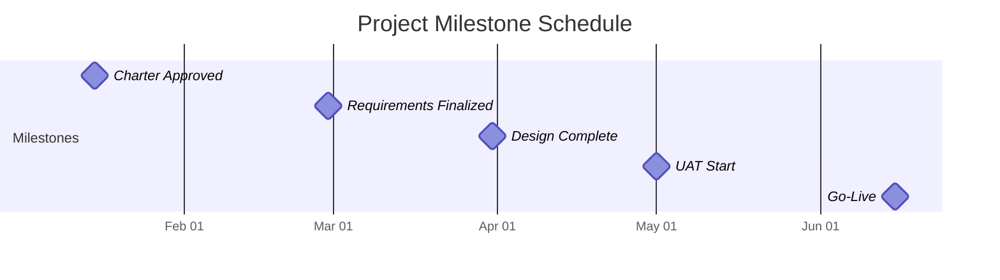

A **Milestone Schedule** is a type of project schedule that **lists key milestones along with their planned dates**, without detailing the full set of activities required to reach them. It provides a **high-level view of significant events or decision points**, helping stakeholders quickly understand the project timeline and progress.

### **Key Characteristics**
- **Simplified View** – Focuses on major outcomes, not detailed task-level planning.
- **Time-Oriented** – Emphasizes when milestones are expected to occur.
- **Communication Tool** – Often used in executive summaries, status reports, or stakeholder briefings.
- **Early Planning Utility** – Useful during initial planning when full details may not yet be available.

### **Use Cases**
- Gaining sponsor or client alignment on critical delivery points.
- Reporting project status without overwhelming detail.
- Structuring phase gates and contractually required checkpoints.

### **Example Milestone Schedule**
| Milestone                     | Planned Date  |
|------------------------------|---------------|
| Project Charter Approved      | Jan 15        |
| Requirements Finalized        | Feb 28        |
| Design Complete               | Mar 31        |
| User Acceptance Testing Start | May 1         |
| Go-Live                       | Jun 15        |

### **Mermaid Diagram: High-Level Milestone Schedule**

### Why Milestone Schedules Matter

- Clarify Expectations – Helps ensure alignment on delivery targets.
- Enable Tracking – Provides checkpoints for measuring progress against time.
- Support Governance – Used to validate readiness for phase transitions or reviews.

See also: [[Milestone]], [[Project Schedule]], [[Project Phase]], [[Schedule Baseline]].