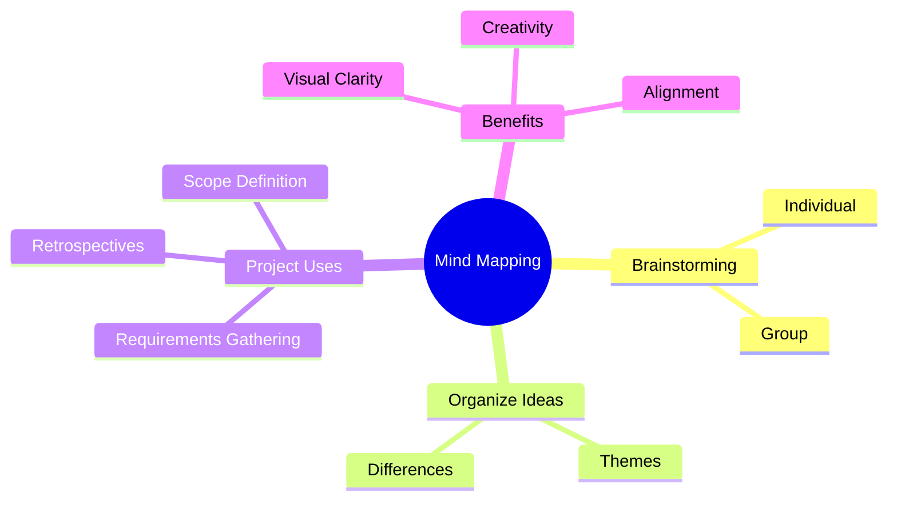

**Mind Mapping** is a **visual technique** used to consolidate ideas generated during individual or group brainstorming sessions into a **single map**. This structure reflects the **common themes, divergences, and interconnections** between ideas. Mind maps help clarify understanding, surface gaps, and encourage creativity by visually organizing information around a central concept.

### **Purpose and Benefits**
- **Consolidates Diverse Inputs** – Gathers scattered thoughts into a coherent structure.
- **Highlights Relationships** – Reveals how ideas connect or differ.
- **Encourages Ideation** – Sparks new ideas through visual exploration.
- **Aids Communication** – Makes complex or abstract thoughts easier to share and review.

### **Common Uses in Project Management**
- Clarifying stakeholder needs
- Organizing meeting outputs
- Defining project scope elements
- Preparing for workshops or retrospectives

### **Mermaid Diagram: Simple Mind Map Example**

### Why Mind Mapping Matters

- Improves Comprehension – Helps teams see the big picture and details in one view.
- Promotes Engagement – Invites active participation in ideation and refinement.
- Accelerates Planning – Supports structured analysis without rigid templates.

See also: [[Affinity Diagram]], [[Workshop Facilitation]], [[Stakeholder Engagement]], [[Scope Definition]].