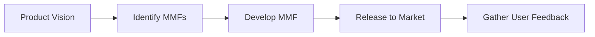

A **Minimum Marketable Feature (MMF)** is a **product or feature that contains just enough functionality to be marketable** and deliver value to users. The goal is to **release something small but complete** that can be **used to validate an idea, generate feedback, or drive early adoption**. MMFs support iterative delivery by focusing on releasing the most essential value-producing components first.

### **Purpose and Characteristics**
- **Market-Ready** – Capable of being released and used immediately by customers.
- **Focused Scope** – Includes only what’s necessary to deliver value—nothing more.
- **Validates Product Ideas** – Lets teams test feature viability with minimal investment.
- **Supports Lean Thinking** – Encourages small batches and rapid delivery cycles.

### **Example Scenarios**
- A music app releases a basic playlist creation feature with limited sharing options to test engagement before building full social functionality.
- A startup delivers a billing module with core invoicing capabilities to support early users while deferring complex reporting features.

### **MMF vs. MVP vs. MBI**
| Concept | Focus              | Goal                                      |
|--------|--------------------|-------------------------------------------|
| **MMF** | Marketability      | Deliver smallest releasable feature users will adopt |
| **MVP** | Customer Learning  | Test assumptions with minimal effort      |
| **MBI** | Business Value     | Deliver smallest unit that brings measurable value |

### **Mermaid Diagram: MMF in Product Delivery**

### Why MMFs Matter

- Accelerate Market Entry – Get products into users’ hands sooner.
- Reduce Risk – Validate core assumptions early before scaling.
- Guide Prioritization – Keeps teams focused on value-producing features.

See also: [[Minimum Viable Product (MVP)]], [[Minimum Business Increment (MBI)]], [[Incremental Approach]], [[Feature Prioritization]].