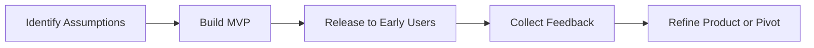

A **Minimum Viable Product (MVP)** is a concept used to **define the smallest set of features or requirements** necessary to **deliver value to customers and gather validated learning**. The MVP is not just about releasing a simplified version of a product—it's about creating a **testable solution** that allows a team to quickly confirm or refute assumptions with real users.

### **Purpose and Characteristics**
- **Focused on Learning** – Built to test hypotheses about user needs and preferences.
- **Reduces Time-to-Feedback** – Released quickly to gain insight before full investment.
- **Delivers Core Value** – Includes only features necessary to solve the primary user problem.
- **Supports Iteration** – Designed to evolve based on what users actually want.

### **Example Scenarios**
- A rideshare startup launches with only core ride-booking functionality and excludes driver ratings or promotions to validate user demand first.
- A SaaS tool releases a basic dashboard with CSV export and waits for user feedback before building integrations and advanced reporting.

### **MVP vs. MMF vs. MBI**
| Concept | Focus              | Goal                                      |
|--------|--------------------|-------------------------------------------|
| **MVP** | Learning           | Test core assumptions quickly             |
| **MMF** | Marketability      | Deliver smallest usable feature for users |
| **MBI** | Business Value     | Deliver smallest increment that impacts business goals |

### **Mermaid Diagram: MVP Validation Loop**

### Why MVPs Matter

- Accelerate Validation – Enables faster discovery of what works and what doesn’t.
- Conserve Resources – Avoids overbuilding before knowing what customers value.
- Enable Agile Planning – Sets a baseline for iterative development based on real usage.

See also: [[Minimum Marketable Feature (MMF)]], [[Minimum Business Increment (MBI)]], [[Incremental Approach]], [[Customer Validation]].