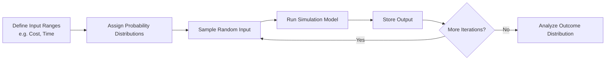

A **Monte Carlo Simulation** is a **quantitative risk analysis method** that evaluates the **impact of uncertainty on project outcomes** by running a large number of simulations through a mathematical or computer model. Each simulation randomly selects values for uncertain variables within defined probability distributions, resulting in a **range of possible outcomes** and associated probabilities.

### **Purpose and Characteristics**
- **Incorporates Uncertainty** – Models variability in inputs to reveal risk exposure.
- **Generates Probability Distributions** – Outputs a range of results with likelihoods.
- **Supports Decision Making** – Provides data for evaluating best- and worst-case scenarios.
- **Requires Repetition** – Often runs thousands of simulations to create reliable data.

### **Common Use Cases**
- Estimating project cost or schedule ranges
- Evaluating risk-adjusted return on investment
- Analyzing decision trees and complex trade-offs
- Prioritizing risks based on outcome variability

### **Example Scenario**
A project schedule has uncertain task durations. Instead of relying on single-point estimates, a Monte Carlo simulation runs 10,000 iterations using optimistic, most likely, and pessimistic durations to estimate the probability of completing the project by a target date.

### **Mermaid Diagram: Monte Carlo Simulation Conceptual Flow**

### Why Monte Carlo Simulation Matters

- Reveals Probabilities – Goes beyond deterministic estimates to show likelihoods of success or failure.
- Improves Risk Awareness – Quantifies uncertainty in both cost and schedule planning.
- Enables Informed Choices – Provides evidence-based support for project risk responses and contingency planning.

See also: [[Risk Management]], [[Decision Tree Analysis]], [[Multipoint Estimating]], [[Schedule Forecasts]].