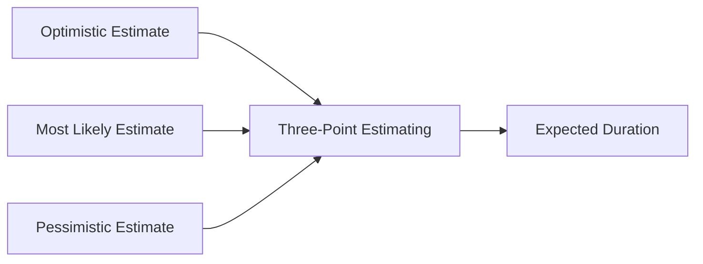

**Most Likely Duration** is the **estimated time that an activity is expected to take under normal conditions**, accounting for all known variables such as resources, complexity, and typical delays. It reflects the **most realistic estimate**, assuming that work proceeds as planned without major risks or accelerations.

### **Purpose and Characteristics**
- **Core of Triangular and Beta Distributions** – Used in both basic and PERT-based estimating.
- **Baseline for Planning** – Often used as the default estimate in deterministic schedules.
- **Balanced Viewpoint** – Unlike optimistic or pessimistic estimates, it assumes moderate risk and average performance.

### **Use in Estimating Techniques**
Most likely duration is one of three estimates typically used in:
- **Three-Point Estimating**: 
  - Optimistic
  - *Most Likely*
  - Pessimistic
- **Program Evaluation and Review Technique (PERT)**:
  - $$E = \frac{O + 4M + P}{6}$$  
  Where *E* is the expected duration, *O* is optimistic, *M* is most likely, and *P* is pessimistic.

### **Example Scenario**
For a task like writing technical documentation, if everything goes as it usually does, the writer estimates it will take **5 days**—that’s the most likely duration. However, it could take **3 days** if everything goes smoothly, or **8 days** if delays occur.

### **Mermaid Diagram: Role in Duration Estimation**

### Why Most Likely Duration Matters

- Improves Accuracy – Forms the anchor for expected value in probabilistic estimating.
- Balances Risk – Helps teams avoid overly aggressive or padded estimates.
- Integrates with Tools – Used in schedule simulations and forecasting models.

See also: [[Optimistic Duration]], [[Pessimistic Duration]], [[Three-Point Estimating]], [[PERT]].