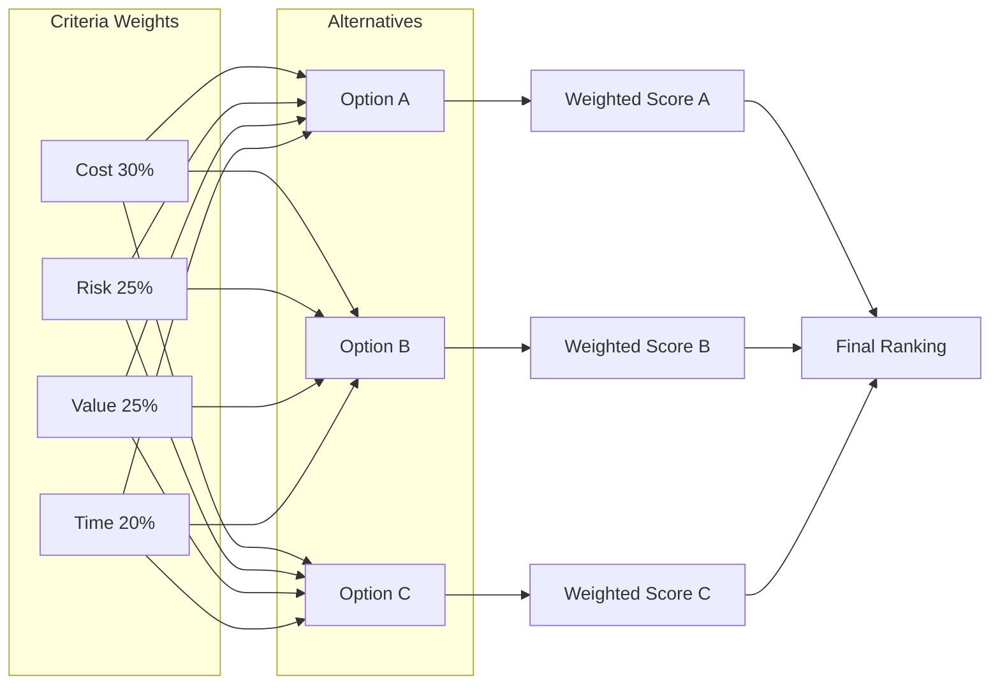

**Multicriteria Decision Analysis (MCDA)** is a structured technique that uses a **decision matrix** to evaluate and rank multiple options based on **predefined criteria** such as risk, cost, benefit, complexity, or uncertainty. It is especially useful when decisions involve **competing factors** that cannot be easily compared using a single metric.

### **Purpose and Characteristics**
- **Structured Evaluation** – Helps teams make transparent, traceable decisions.
- **Quantifies Subjectivity** – Converts qualitative judgments into weighted scores.
- **Supports Complex Trade-Offs** – Balances multiple priorities across stakeholders.
- **Enables Comparison** – Ranks options based on cumulative weighted scores.

### **Typical Steps in MCDA**
1. Define the decision alternatives.
2. Establish evaluation criteria.
3. Assign weights to each criterion based on importance.
4. Score each alternative against the criteria.
5. Calculate weighted totals to determine the preferred option.

### **Example Scenario**
A project team must choose between three vendors. Criteria include cost, delivery time, technical capability, and risk. Using MCDA, they score each vendor per criterion and apply weightings to reflect organizational priorities.

### **Mermaid Diagram: MCDA Matrix Representation**

This diagram conveys:

- Criteria are weighted inputs flowing into each option.
- Options are scored and aggregated into weighted totals.
- All results are compared for final decision-making.

### Why MCDA Matters

- Brings Objectivity to Complex Choices – Especially valuable in stakeholder-heavy environments.
- Supports Defensible Decisions – Useful for procurement, prioritization, or risk-based selections.
- Adapts Easily – Can be scaled for high-level strategy or low-level task selection.

See also: [[Cost-Benefit Analysis]], [[Risk Assessment]], [[Prioritization Techniques]], [[Decision Tree Analysis]]. 