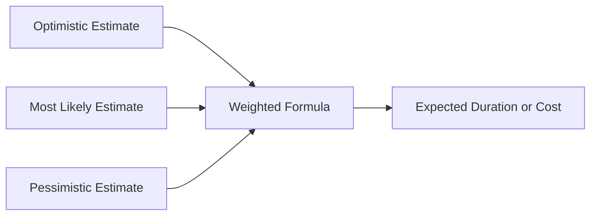

**Multipoint Estimating** is a technique used to estimate **cost or duration** by applying an **average or weighted average** of three inputs: an **optimistic**, a **most likely**, and a **pessimistic** estimate. This approach accounts for **uncertainty and variability**, making it more reliable than single-point estimates in environments where outcomes are not guaranteed.

### **Purpose and Characteristics**
- **Models Uncertainty** – Captures the range of possible outcomes instead of a fixed value.
- **Improves Accuracy** – Produces more realistic expectations using weighted calculations.
- **Inputs Variability** – Considers best-case, worst-case, and expected-case scenarios.
- **Feeds Risk Analysis** – Commonly used in Monte Carlo simulations and contingency planning.

### **Common Formula (PERT Estimate)**
The most common implementation is the **Program Evaluation and Review Technique (PERT)** estimate:

$$
E = \frac{O + 4M + P}{6}
$$

Where:  
- *O* = Optimistic estimate  
- *M* = Most likely estimate  
- *P* = Pessimistic estimate  
- *E* = Expected estimate

### **Example Scenario**
A task might take 3 days if everything goes well (*optimistic*), 5 days under normal conditions (*most likely*), and 10 days if issues arise (*pessimistic*). The weighted estimate would be:

$$
E = \frac{3 + 4(5) + 10}{6} = 5.5 \text{ days}
$$

### **Mermaid Diagram: Multipoint Estimating Flow**

This structure shows how three inputs feed into a weighted calculation, resulting in a more reliable output.

### Why Multipoint Estimating Matters

- Reduces Risk of Under/Overestimation – By considering a range, it’s harder to be blindsided.
- Builds Confidence – Provides a stronger basis for forecasts and planning decisions.
- Enables Smarter Contingency Planning – Helps determine appropriate buffers or reserves.

See also: [[Three-Point Estimating]], [[Most Likely Duration]], [[Optimistic Duration]], [[Pessimistic Duration]], [[PERT]], [[Monte Carlo Simulation]].