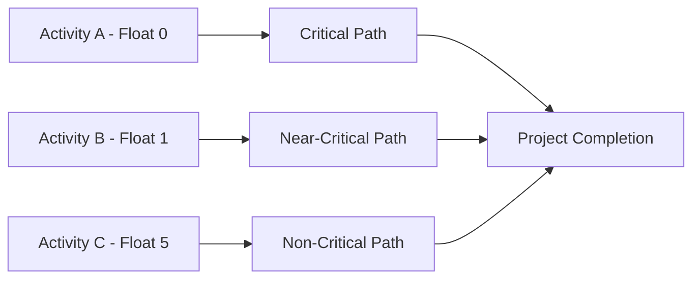

A **Near-Critical Activity** is a **scheduled task with low total float**, meaning it has **very little scheduling flexibility** before it could delay the project’s overall completion. While not currently on the critical path, it is **at risk of becoming critical** if its float is consumed due to delays, rework, or resource issues.

### **Purpose and Characteristics**
- **Low Total Float** – Typically identified based on a threshold (e.g. 0–2 days float).
- **High Monitoring Priority** – Often tracked as closely as critical activities.
- **Dynamic Nature** – Can shift to or from the critical path during project execution.
- **Depends on Judgment** – What’s considered "near-critical" may vary by project complexity or risk tolerance.

### **Example Scenario**
In a construction project, painting the interior might have just one day of float. If the flooring installation is delayed and painting can't start on time, the overall completion date could be threatened—making it a near-critical activity.

### **Mermaid Diagram: Near-Critical Activity Context**

This diagram shows how different activities with varying float levels contribute to different paths—critical, near-critical, and non-critical—all converging on project completion.

### Why Near-Critical Activities Matter

- Early Warning Indicators – Small delays can turn them into critical risks.
- Schedule Risk Management – Helps identify where to focus effort and resources.
- Supports Proactive Intervention – Enables replanning before critical path impact occurs.

See also: [[Critical Path]], [[Near-Critical Path]], [[Total Float]], [[Free Float]].