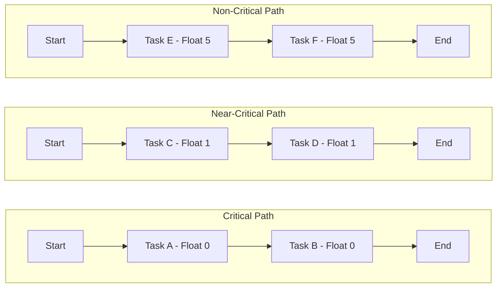

A **Near-Critical Path** is a **sequence of scheduled activities** that possesses **low total float**, meaning it is **close to becoming a critical path** if any additional delay occurs. Though not currently the longest path through the schedule, it presents a **significant schedule risk** because its buffer is minimal and easily consumed.

### **Purpose and Characteristics**
- **Low Total Float Threshold** – Typically flagged when float is within a narrow range (e.g. 0–2 days).
- **Not Currently Critical** – But it can quickly become critical with minor slippage.
- **Monitored Closely** – Especially in high-risk or resource-constrained projects.
- **Shifts Dynamically** – Changes in duration or float on any path can cause near-critical paths to become critical.

### **Example Scenario**
If a project has two primary sequences of activities—one with zero float (critical) and another with one day of float (near-critical)—any delay in the near-critical path puts the overall delivery date at risk, effectively turning it into a second critical path.

### **Mermaid Diagram: Path Classification by Float**

This visual highlights how multiple paths flow toward project completion, with only small differences in float separating near-critical from critical status.

### Why Near-Critical Paths Matter

- Indicate Schedule Fragility – Show how close the project is to delay risks beyond the known critical path.
- Enable Focused Monitoring – Help prioritize additional tracking and resource management.
- Improve Risk Response Readiness – Support early intervention to avoid cascading delays.

See also: [[Critical Path]], [[Near-Critical Activity]], [[Total Float]], [[Free Float]].