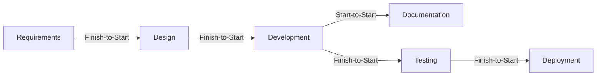

**Network Logic** refers to the **set of dependencies and relationships** that connect all scheduled activities within a **project schedule network diagram**. It defines the **sequence in which tasks must be executed**, based on constraints, resource availability, and logical order. The structure created by network logic forms the foundation for **critical path analysis**, float calculation, and scheduling decisions.

### **Purpose and Characteristics**
- **Defines Activity Sequencing** – Establishes which tasks must occur before, after, or concurrently with others.
- **Enables Schedule Calculations** – Used to compute early/late start and finish dates.
- **Built on Logical Relationships** – Includes finish-to-start, start-to-start, finish-to-finish, and start-to-finish dependencies.
- **Essential for Path Analysis** – Supports identification of critical and near-critical paths.

### **Example Scenario**
In a software project, coding must finish before testing begins. This finish-to-start dependency is part of the network logic. If documentation can start while testing begins, a start-to-start relationship is also included—adding complexity to the network logic.

### **Mermaid Diagram: Sample Network Logic with Dependencies**

This diagram demonstrates how logical relationships define the order and constraints between project tasks.

Why Network Logic Matters

- Prevents Scheduling Conflicts – Ensures the sequence respects technical and practical constraints.
- Drives Accurate Forecasting – Forms the basis for start/finish date calculation and float determination.
- Enables Critical Path Identification – Helps project managers prioritize tasks that directly affect project duration.

See also: [[Network Path]], [[Early Start Date]], [[Early Finish Date]], [[Late Start Date]], [[Late Finish Date]], [[Logical Relationship]].