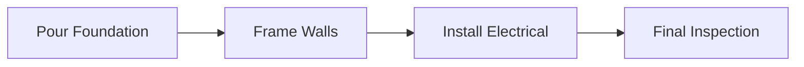

A **Node** is a **specific point on a schedule network diagram** where **dependency lines connect**, representing an **activity, event, or milestone** within the project schedule. Nodes are the **building blocks of precedence-based diagrams**, showing how work is sequenced and where relationships begin or end.

### **Purpose and Characteristics**
- **Represents Work or Milestones** – Each node typically reflects a scheduled activity or significant event.
- **Connects Dependencies** – Links are drawn between nodes to indicate logic-driven relationships.
- **Used in PDM** – Central to the Precedence Diagramming Method (PDM), where nodes are activities and arrows are dependencies.
- **Visualizes Flow** – Helps communicate sequencing, timing, and critical path relationships.

### **Example Scenario**
In a construction project, nodes might include:
- Pour Foundation  
- Frame Walls  
- Install Electrical  

Each is represented as a node, connected by dependency lines indicating that one must finish before the next can start.

### **Mermaid Diagram: Nodes and Dependencies in a Network**

Each box is a node, and the arrows show the dependencies between them, forming a simplified portion of a project network diagram.

Why Nodes Matter

- Enable Structured Scheduling – Allow planners to define and control the sequence of work.
- Support Analysis – Used to identify paths, calculate float, and analyze scheduling risk.
- Improve Communication – Visually organize complex task relationships for stakeholders.

See also: [[Precedence Diagramming Method]], [[Project Schedule Network Diagram]], [[Network Logic]], [[Dependency]].