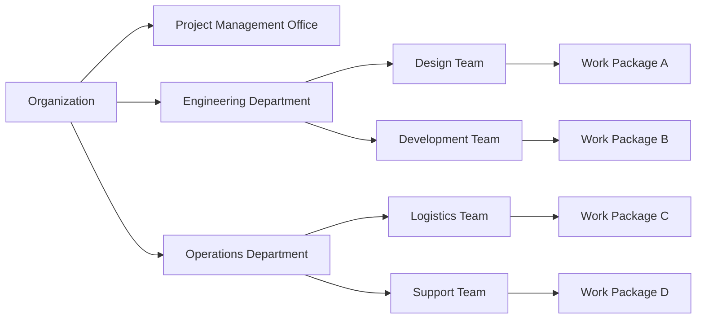

# Organizational Breakdown Structure (OBS)

An **Organizational Breakdown Structure (OBS)** is a **hierarchical representation of the project organization** that maps project activities to the **organizational units** responsible for performing them. It visually connects the **people or departments** in the organization to specific parts of the project work.

The OBS facilitates responsibility assignment and ensures alignment between the project structure and the organization's operational framework.

## Key Aspects of an OBS

- **Hierarchical Structure** – Shows reporting and responsibility relationships  
- **Activity Mapping** – Links work packages or activities to the performing unit  
- **Responsibility Tracking** – Used with RACI or other matrices for clarity  
- **Integration with WBS** – OBS complements WBS to show who does what

## Example Scenarios

- Assigning work packages in a large engineering project to department leads  
- Mapping project scope to regional business units for global execution  
- Creating input for a Responsibility Assignment Matrix (RAM)

## Mermaid Diagram: Example Organizational Breakdown Structure

## Why Organizational Breakdown Structure Matters

- Clarifies Accountability – Connects tasks to responsible organizational units
- Improves Oversight – Enables targeted management and resource allocation
- Supports Reporting – Facilitates communication across departments
- Enables Governance Alignment – Links project work to formal authority structures

See also: [[Resource Breakdown Structure]], [[Risk Breakdown Structure]], [[Work Breakdown Structure (WBS)]], [[Responsibility Assignment Matrix]], [[Project Governance]].