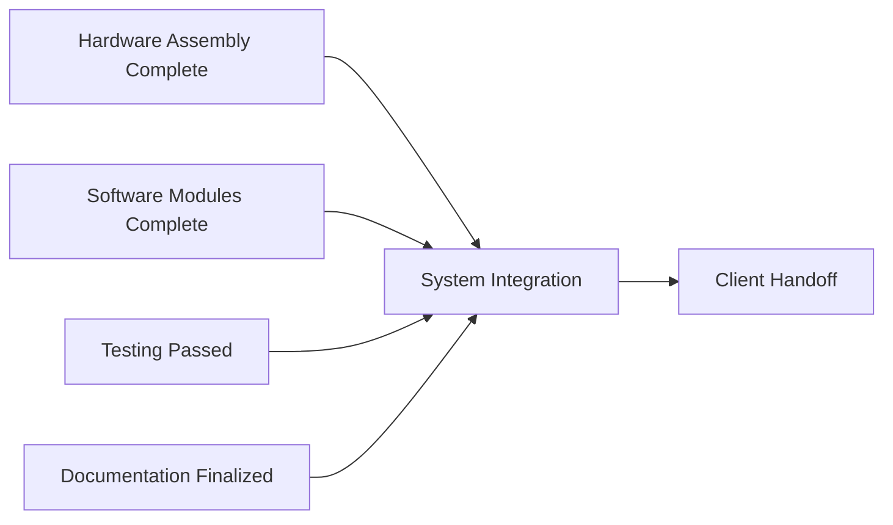

**Path Convergence** is a **relationship in which a schedule activity has more than one predecessor**. This means multiple paths in the project schedule lead into a single activity, and **all predecessor activities must be completed** before the converging activity can begin.

Converging paths often represent **integration points**, **milestones**, or **handoffs**, where work streams must align precisely. These are critical for timing and coordination and often introduce increased risk due to dependency complexity.

## Key Characteristics

- **Multiple Inputs** – One activity is dependent on several preceding tasks  
- **Synchronization Required** – All predecessors must finish before the activity begins  
- **Risk Concentration** – Any delay upstream delays the converging node  
- **Common in Delivery Phases** – Frequently seen before launches, integrations, and approvals

## Example Scenarios

- System integration requires hardware, software, and testing to be complete  
- Go-live is dependent on training, documentation, and final sign-off  
- A product demo depends on feature completion, bug fixes, and user acceptance testing

## Mermaid Diagram: Path Convergence Example

## Why Path Convergence Matters

- Reveals Bottlenecks – Pinpoints activities where multiple delays can stack
- Highlights Risk Zones – Identifies where timeline pressure converges
- Improves Planning – Enables targeted buffers and tighter coordination
- Supports Critical Path Management – Essential for identifying scheduling constraints

See also: [[Path Divergence]], [[Predecessor Activity]], [[Successor Activity]], [[Schedule Network Diagram]], [[Critical Path]].