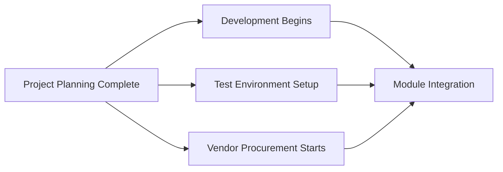

**Path Divergence** is a **relationship in which a schedule activity has more than one successor**. It occurs when the completion of a single task triggers the start of multiple downstream activities. Each successor is dependent on the diverging activity being completed before it can begin.

This relationship is often seen during **planning handoffs**, **resource distribution**, or **parallel execution paths**, and it requires careful coordination to ensure successors receive timely input.

## Key Characteristics

- **Multiple Outputs** – A single activity branches out into two or more successors  
- **Parallel Sequencing** – Enables simultaneous work streams  
- **Critical Timing** – Delays in the diverging task can cascade across multiple paths  
- **Resource-Intensive** – Often requires cross-team synchronization and allocation

## Example Scenarios

- Completion of planning triggers development, testing setup, and procurement  
- A design approval launches manufacturing, marketing, and compliance activities  
- Sprint planning concludes and activates multiple feature development tracks

## Mermaid Diagram: Path Divergence Example

## Why Path Divergence Matters

    Enables Parallel Execution – Accelerates progress by launching multiple streams

    Increases Coordination Needs – Requires alignment across successor tasks

    Highlights Cascade Risk – A delay in one task can affect many downstream activities

    Supports Schedule Optimization – Identifies where parallelism can reduce timeline

See also: [[Path Convergence]], [[Predecessor Activity]], [[Successor Activity]], [[Schedule Network Diagram]], [[Critical Path]].