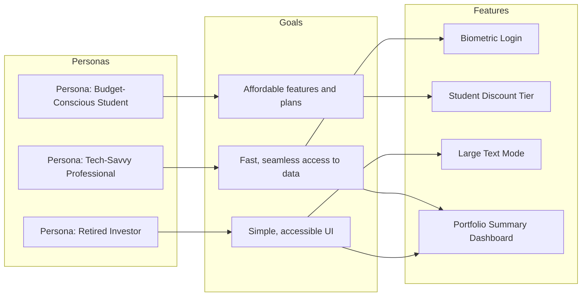

# Personas

**Personas** are **archetypal representations of end users** created to reflect common goals, behaviors, motivations, and characteristics. They are used in **user-centered design**, product development, and requirements gathering to ensure the needs of real users are considered throughout the project.

Each persona is based on research and patterns observed across similar users and helps align design decisions with actual user expectations.

## Key Characteristics

- **Research-Based** – Derived from user interviews, surveys, and data analysis  
- **Behavior-Focused** – Includes goals, pain points, preferences, and context  
- **Representative, Not Real** – Fictional but grounded in actual user insights  
- **Communication Tool** – Helps project teams empathize with and design for users

## Example Scenarios

- A mobile banking app project defines personas like "Busy Professional," "Budget-Conscious Student," and "Retired Investor"  
- A product team designing a healthcare portal uses personas to identify accessibility needs  
- An agile team prioritizes features based on persona-specific user stories

## Mermaid Diagram: Personas and Product Relevance

## Why Personas Matter

- Promote Empathy – Help teams understand user needs and behaviors
- Guide Requirements – Inform design, functionality, and content decisions
- Support Alignment – Keep teams focused on user value and relevance
- Improve Outcomes – Drive solutions that better serve the intended audience

See also: [[Stakeholder Analysis]], [[User Stories]], [[Requirements Documentation]], [[Product Backlog]], [[Customer Requirements]].