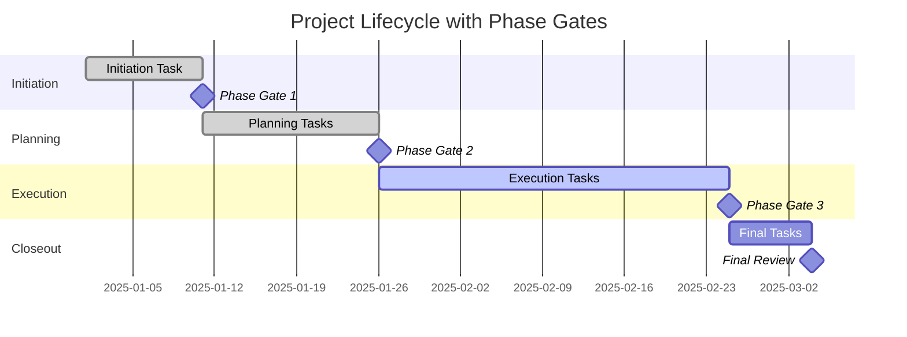

# Phase Gate

A **Phase Gate** is a **formal review conducted at the end of a project phase** to decide whether to **proceed to the next phase**, **modify the current plan**, or **terminate the program or project**. It acts as a **control point** that ensures alignment with business objectives, stakeholder expectations, and project feasibility before moving forward.

Phase gates are integral to stage-based project governance models and provide an opportunity for structured evaluation, validation, and authorization.

## Key Characteristics

- **Decision-Oriented** – Results in a go, no-go, or revise decision  
- **Criteria-Based** – Requires deliverables, performance metrics, and approvals  
- **Formalized** – Part of the organization’s governance and methodology  
- **Used in All Project Types** – Common in waterfall, hybrid, and gated-agile approaches

## Example Scenarios

- A project completes the planning phase and enters a gate review to authorize execution  
- After design, stakeholders review scope, budget, and technical feasibility before development  
- At the end of deployment, a gate checks readiness before initiating operations and support

## Mermaid Diagram: Gantt with Phase Gates

## Why Phase Gate Matters

- Strengthens Governance – Ensures each phase meets defined criteria before proceeding
- Reduces Risk – Prevents flawed work from moving forward unchecked
- Improves Stakeholder Confidence – Reinforces transparency and accountability
- Supports Better Decisions – Allows for reevaluation and reprioritization as needed

See also: [[Project Phase]], [[Project Lifecycle]], [[Stage-Gate Process]], [[Governance]], [[Milestone]].