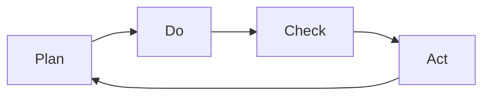

**Plan-Do-Check-Act (PDCA)** is an **iterative management method** used to support the **control and continual improvement of processes and products**. It provides a structured cycle for testing ideas, implementing changes, validating outcomes, and refining practices.

PDCA is widely applied in quality management, operations, and Agile environments to foster adaptive learning and consistent performance improvement.

## Key Characteristics

- **Iterative Cycle** – Designed for repetition and continuous refinement  
- **Evidence-Based** – Each step includes validation or feedback  
- **Flexible Application** – Usable across all industries and organizational levels  
- **Rooted in Quality Systems** – Originates from lean and Six Sigma methodologies

## Example Scenarios

- A software team uses PDCA to improve deployment reliability  
- A manufacturing process applies PDCA to reduce defect rates  
- A service desk applies PDCA to streamline ticket resolution workflows

## Mermaid Diagram: PDCA Circular Flow

## Why Plan-Do-Check-Act Matters

- Enables Continuous Improvement – Encourages learning through structured feedback loops
- Reduces Waste and Errors – Helps refine processes through evidence-based changes
- Improves Quality Control – Promotes consistency and measured outcomes
- Drives Adaptability – Supports agile, responsive management approaches

See also: [[Kaizen]], [[Continuous Improvement]], [[Quality Management Plan]], [[Lessons Learned Register]], [[Corrective Action]].