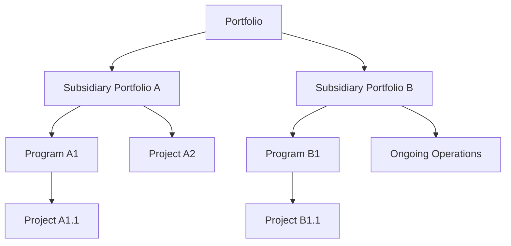

A **Portfolio** is a collection of **projects, programs, subsidiary portfolios, and operations** managed **as a group** to achieve **strategic objectives**. The components of a portfolio are not necessarily interdependent but are aligned to support enterprise goals, optimize resources, and balance risk and value.

Portfolios provide a high-level structure for aligning initiatives with business strategy and ensuring coordinated oversight.

## Key Characteristics

- **Strategic Focus** – Oriented around enterprise goals and value delivery  
- **Aggregated Management** – Combines multiple initiatives under unified governance  
- **Flexible Composition** – Includes independent or interrelated components  
- **Optimized for Value** – Enables prioritization and resource allocation across efforts

## Example Scenarios

- An organization manages a technology portfolio including cloud migration, data analytics programs, and IT operations  
- A global company organizes its portfolios by region to align with localized strategies  
- Corporate strategy defines a sustainability portfolio consisting of green energy projects and regulatory programs

## Mermaid Diagram: Portfolio Structure (Top-Down)

## Why Portfolio Matters

- Aligns Execution with Strategy – Ensures initiatives support enterprise goals
- Optimizes Resource Use – Allocates funding, people, and tools across priorities
- Enhances Visibility and Control – Provides governance across programs and projects
- Balances Risk and Value – Manages investments as a coordinated whole

See also: [[Program]], [[Project]], [[Strategic Alignment]], [[Portfolio Management]], [[Enterprise Environmental Factors (EEFs)]].