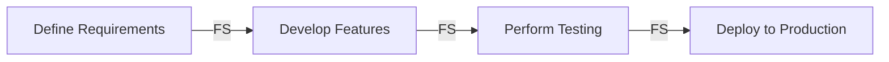

The **Precedence Diagramming Method (PDM)** is a **network scheduling technique** that visually represents **project activities and their dependencies**. It is commonly used in **Critical Path Method (CPM)** scheduling to define the sequence of work.

## Key Aspects of Precedence Diagramming Method (PDM)
- **Uses Nodes for Activities** – Tasks are represented as boxes (nodes).
- **Defines Task Dependencies** – Uses arrows to show relationships between tasks.
- **Supports Critical Path Analysis** – Helps determine the longest sequence of tasks.
- **Identifies Four Dependency Types** – Finish-to-Start (FS), Start-to-Start (SS), Finish-to-Finish (FF), and Start-to-Finish (SF).

## Types of Dependencies in PDM
1. **Finish-to-Start (FS)** – Task B **cannot start** until Task A **finishes**. *(Most common)*
2. **Start-to-Start (SS)** – Task B **cannot start** until Task A **starts**.
3. **Finish-to-Finish (FF)** – Task B **cannot finish** until Task A **finishes**.
4. **Start-to-Finish (SF)** – Task B **cannot finish** until Task A **starts** *(Rarely used)*.

## Example Scenario

### **Software Development Project**
A simplified PDM example for **feature release**:
- **Define Requirements (A)**
- **Develop Features (B)**
- **Perform Testing (C)**
- **Deploy to Production (D)**

### **Mermaid Diagram: Precedence Diagramming Method Example**

## Why PDM Matters

- Optimizes Scheduling – Clearly defines how tasks are linked.
- Identifies Critical Path – Highlights activities that determine project duration.
- Prevents Scheduling Conflicts – Ensures tasks are sequenced correctly.
- Improves Resource Allocation – Helps teams plan workloads efficiently.

See also: [[Schedule Network Diagram]], [[Critical Path Method (CPM)]], [[Dependency Management]], [[Gantt Chart]].