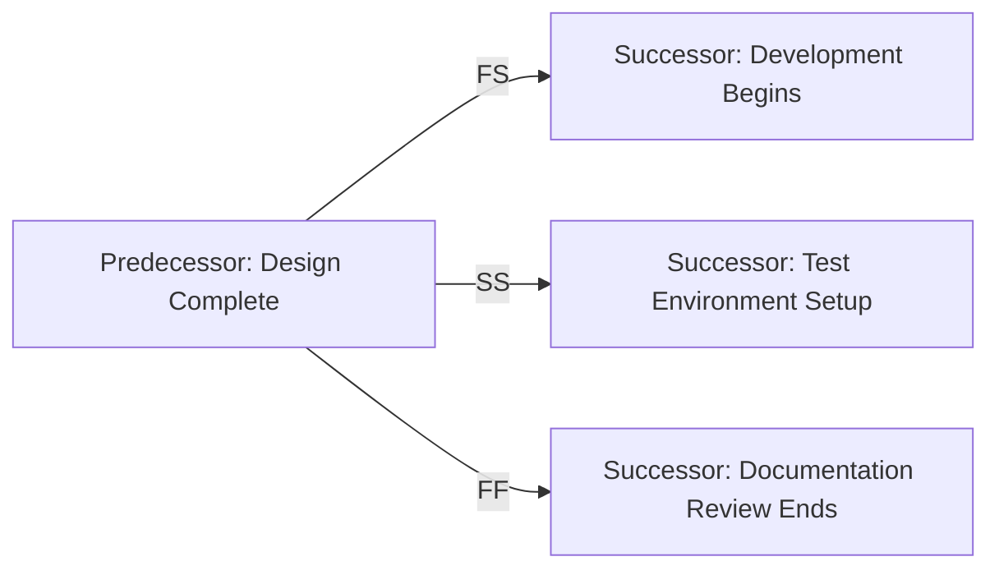

# Predecessor Activity

A **Predecessor Activity** is an activity that **logically comes before a dependent (successor) activity** in a project schedule. The timing and sequence of the successor are determined by the relationship with its predecessor.

Predecessor activities define how and when dependent work can begin or end, and are critical to building a schedule model using the Precedence Diagramming Method (PDM).

## Key Characteristics

- **Defines Sequence** – Determines the order of activities  
- **Drives Dependency Logic** – May influence start or finish of successors  
- **Used in All Schedule Models** – Common to all network-based scheduling techniques  
- **Impacts Critical Path** – Delays in predecessors can propagate downstream

## Example Scenarios

- Code development must finish before testing can start (Finish-to-Start)  
- Procurement must start before onboarding a vendor (Start-to-Start)  
- Approval must finish before product launch can finish (Finish-to-Finish)

## Mermaid Diagram: Predecessor Relationships

## Why Predecessor Activity Matters

- Ensures Logical Flow – Creates a structured and traceable schedule
- Enables Accurate Forecasting – Allows impact analysis for upstream changes
- Supports Dependency Management – Identifies which tasks must be completed first
- Feeds Critical Path Analysis – Helps determine project timeline constraints

See also: [[Successor Activity]], [[Summary Activity]], [[Precedence Diagramming Method]], [[Logical Relationship]], [[Schedule Network Diagram]].