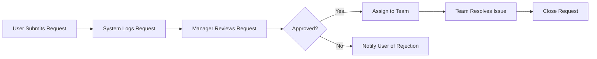

**Process Flow** is a **business analysis model** that **visually represents the steps** taken in a process by a **human user interacting with a system implementation**. It illustrates the sequence, decision points, and handoffs involved in completing a task or delivering an outcome.

A similar structure, called a **system flow**, is used to show steps executed automatically by a system without human intervention.

## Key Characteristics

- **Step-Based Visualization** – Shows actions, decisions, and flow of control  
- **Human Interaction Focus** – Emphasizes user-system interaction  
- **Sequential Logic** – Follows the actual order of operations  
- **Supports Documentation and Analysis** – Useful for identifying inefficiencies or improvement areas

## Example Scenarios

- A user submits a service request, which is reviewed, assigned, and resolved through a tracked flow  
- A purchase approval process moves through user submission, manager approval, and finance verification  
- A support ticket process includes triage, assignment, escalation, and resolution steps

## Example Process Flow

## Why Process Flow Matters

- **Clarifies Work Execution** – Helps teams understand how tasks are completed  
- **Enables Process Improvement** – Identifies redundancies, delays, and decision points  
- **Supports System Design** – Informs system requirements and automation potential  
- **Improves Stakeholder Communication** – Provides a shared visual language for understanding workflows

See also: [[Process]], [[Workflow]], [[Business Requirements]], [[System Flow]], [[Process Improvement]].
