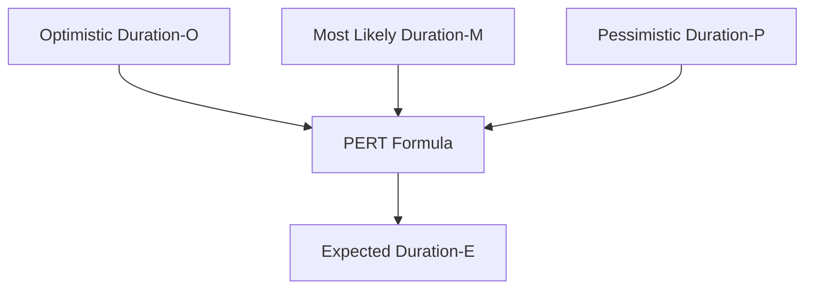

**Program Evaluation and Review Technique (PERT)** is a technique used to **estimate project duration** when there is **uncertainty in activity estimates**. It applies a **weighted average formula** to combine the **optimistic**, **most likely**, and **pessimistic** durations for each activity, producing a more realistic expectation of how long the activity will take.

PERT is particularly useful for projects with high variability or limited historical data.

## Key Characteristics

- **Three-Point Estimating** – Uses optimistic (O), most likely (M), and pessimistic (P) durations  
- **Weighted Formula** – Places more emphasis on the most likely estimate  
- **Focuses on Uncertainty** – Designed for activities with unclear or variable durations  
- **Used in Network Analysis** – Supports schedule modeling and critical path calculations

## Example Scenarios

- A research project with experimental tasks uses PERT to account for possible delays  
- Product development work with new technologies applies PERT to plan realistic timelines  
- Estimating the duration of an approval process with wide variability across stakeholders

## PERT Formula (Expected Duration)

$$
E = \frac{O + 4M + P}{6}
$$

## Mermaid Diagram: PERT Components and Flow

## Role in Project Estimation

- Accounts for Uncertainty – Produces a more realistic activity duration
- Improves Planning Accuracy – Balances best-case and worst-case possibilities
- Supports Critical Path Method (CPM) – Enhances schedule modeling under risk
- Useful in High-Variability Work – Ideal when little reliable data is available

See also: [[Analogous Estimating]], [[Bottom-Up Estimating]], [[Parametric Estimating]], [[Multipoint Estimating]], [[Three-Point Estimating]].