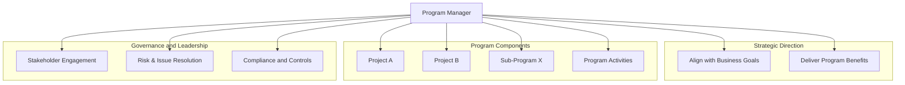

The **Program Manager** is the **person authorized by the performing organization** to **lead the team or teams responsible for achieving program objectives**. This role oversees the planning, execution, and integration of program components to ensure alignment with strategic goals and delivery of intended benefits.

The program manager operates at a level above individual project management, coordinating efforts, resolving interdependencies, and providing leadership across the program.

## Key Characteristics

- **Authority and Accountability** – Responsible for achieving program-level outcomes  
- **Cross-Project Coordination** – Oversees multiple projects and sub-programs  
- **Strategic Alignment** – Ensures program execution supports enterprise objectives  
- **Stakeholder Engagement** – Manages relationships and communications across all levels

## Example Scenarios

- A program manager leads a multi-year expansion program with construction, operations, and IT components  
- The program manager balances priorities and resources across several interrelated projects  
- A global program manager aligns regional workstreams under a common transformation strategy

## Mermaid Diagram: Program Manager Oversight and Coordination

## Role in Program Execution

- **Drives Integrated Delivery** – Coordinates planning and execution across components  
- **Enables Governance and Oversight** – Ensures compliance with organizational controls  
- **Resolves Risks and Issues** – Escalates and mitigates across project boundaries  
- **Delivers Program Benefits** – Focuses on outcomes that exceed individual project value

See also: [[Portfolio Manager]], [[Project Manager]], [[Program]], [[Program Management]], [[Governance]].
