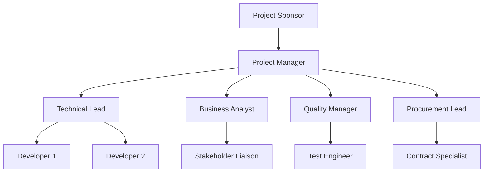

The **Project Organization Chart** is a **document that graphically depicts the project team members and their interrelationships** for a specific project. It visually outlines reporting lines, authority structures, and communication pathways within the team to ensure clarity in roles and responsibilities.

This chart helps align expectations, supports accountability, and improves coordination across the project team.

## Key Characteristics

- **Hierarchical Visualization** – Shows team structure from leadership to contributors  
- **Clarifies Reporting Relationships** – Defines who reports to whom  
- **Supports Role Clarity** – Reinforces understanding of authority and accountability  
- **Can Be Dynamic** – Adjusts with team size, phase, or organizational needs

## Example Scenarios

- A project manager references the chart to delegate tasks to leads across workstreams  
- A new team member reviews the chart to understand the chain of command  
- Stakeholders use the chart to identify escalation paths and contact points

## Example Organization Chart

## Role in Team Coordination

- **Improves Communication** – Establishes clear contact and reporting channels  
- **Enables Accountability** – Visualizes role ownership and authority  
- **Supports Onboarding** – Helps new members understand the team structure  
- **Enhances Governance** – Reinforces formal oversight and control pathways

See also: [[Project Team]], [[Roles and Responsibilities]], [[Responsibility Assignment Matrix (RAM)]], [[Stakeholder Register]], [[Project Management Plan]].
