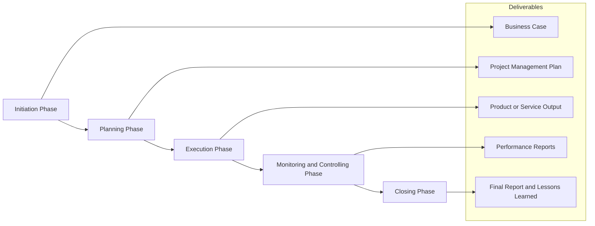

A **Project Phase** is a **collection of logically related project activities** that **culminates in the completion of one or more deliverables**. Phases divide the project into manageable segments, allowing for more effective planning, control, and oversight.

Each phase represents a distinct stage in the project life cycle and typically concludes with a review or approval step to transition into the next.

## Key Characteristics

- **Grouped by Logic and Purpose** – Activities are organized around specific outcomes  
- **Phase Deliverables** – Each phase produces outputs that advance the project  
- **Supports Control and Oversight** – Facilitates checkpoints and decision gates  
- **Can Be Sequential or Overlapping** – Tailored to the development approach used

## Example Scenarios

- A software development project includes initiation, planning, development, testing, and deployment phases  
- A marketing project phases work into research, strategy, creative production, and launch  
- A construction effort is structured by permitting, site prep, build, and inspection phases

## Mermaid Phase Chart

## Role in Project Structure

- **Improves Manageability** – Breaks complex projects into controllable chunks  
- **Supports Governance** – Allows reviews and decisions at key transition points  
- **Enables Focused Execution** – Concentrates resources and attention on specific outcomes  
- **Enhances Predictability** – Allows more accurate estimation and progress tracking

See also: [[Phase Gate]], [[Project Life Cycle]], [[Milestone]], [[Work Breakdown Structure (WBS)]], [[Project Management Plan]].
