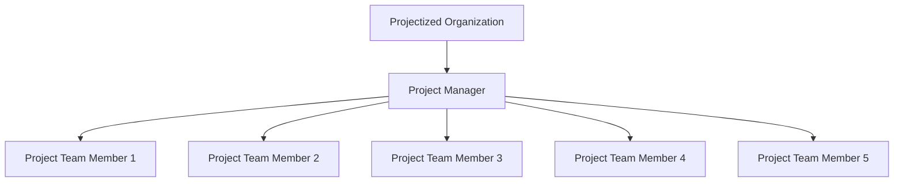

A **Projectized Organization** is an **organizational structure in which the project manager has full authority to assign work and apply resources**. In this environment, teams are often organized by projects rather than by functional departments, and project managers have direct control over budget, scheduling, staffing, and decision-making.

This structure emphasizes speed, accountability, and autonomy in project execution.

## Key Characteristics

- **Full Project Authority** – Project managers control all project resources and decisions  
- **Dedicated Teams** – Staff report directly to the project manager for the duration of the project  
- **Minimal Functional Overlap** – Functional departments provide limited oversight or involvement  
- **Project-Centric Structure** – Organization revolves around projects as the primary units of work

## Example Scenarios

- A consulting firm operates with separate teams and leadership for each client engagement  
- A construction company assigns personnel exclusively to project-based roles  
- A defense contractor organizes staff and assets entirely around long-term programs

## Example Projectized Organization Chart

## Role in Delivery

- **Speeds Decision-Making** – Reduces dependencies on functional chains of command  
- **Enhances Accountability** – Clear ownership of success or failure  
- **Supports Focused Execution** – Teams are fully dedicated to project goals  
- **Simplifies Communication** – Streamlined reporting and control structures

See also: [[Functional Organization]], [[Matrix Organization]], [[Organizational Structure]], [[Project Manager]], [[Governance]].
