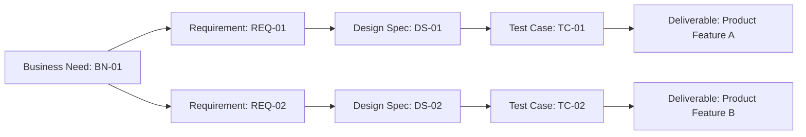

A **Requirements Traceability Matrix** is a grid that links product requirements from their origin to the deliverables that satisfy them.

It ensures that all requirements are accounted for throughout the project lifecycle, enabling visibility, validation, and control as each requirement is traced through development, testing, and delivery.

## Key Characteristics

- **End-to-End Mapping** – Tracks requirements from source through to completion  
- **Supports Validation** – Verifies that deliverables meet stated needs  
- **Enables Impact Analysis** – Assesses effect of changes to requirements  
- **Ensures Accountability** – Identifies ownership and implementation status  

## Example Scenarios

- Verifying that all customer requirements are addressed in the final product  
- Tracking regulatory requirements through design, implementation, and testing  
- Identifying gaps in coverage during scope validation  

## Example Requirements Tracability Matrix

## Role in Scope and Quality Management

- **Improves Transparency** – Provides a clear audit trail of requirements fulfillment  
- **Facilitates Scope Control** – Helps manage the impact of requirement changes  
- **Enhances Quality Assurance** – Ensures that every requirement is tested and validated  
- **Aligns Stakeholders** – Confirms shared understanding of requirement satisfaction  

See also: [[Requirements Management Plan]], [[Requirements Documentation]], [[Validation]], [[Scope Baseline]], [[Change Control Plan]].
