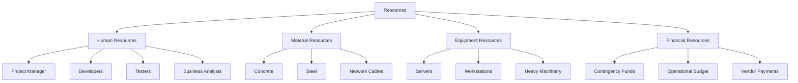

A **Resource Breakdown Structure** is a hierarchical representation of resources by category and type.

It provides a structured view of all resources required for the project, enabling clear planning, assignment, tracking, and control across labor, materials, equipment, and other categories.

## Key Characteristics

- **Hierarchical Format** – Groups resources from general to specific  
- **Covers All Resource Types** – Includes human, material, equipment, and financial resources  
- **Improves Planning Accuracy** – Helps define what is needed and when  
- **Supports Allocation and Tracking** – Links resources to activities and responsibilities  

## Example Scenarios

- Defining all labor types needed for project execution  
- Breaking down materials by use, quantity, and sourcing  
- Mapping out required tools and specialized equipment 

## Example Resource Management Breakdown Structure

## Role in Resource Management

- **Enables Effective Allocation** – Supports matching resources to project needs  
- **Improves Cost Estimation** – Assists in developing accurate resource-based budgets  
- **Supports Responsibility Assignment** – Informs creation of RACI and other matrices  
- **Feeds Into Scheduling** – Provides input for resource leveling and optimization  

See also: [[Organizational Breakdown Structure]], [[Risk Breakdown Structure]], [[Work Breakdown Structure]], [[Resource Management Plan]], [[Responsibility Assignment Matrix]].
