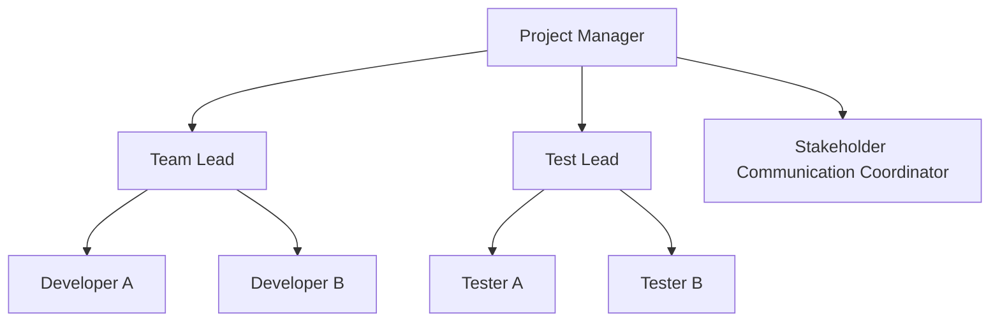

**Responsibility** is an assignment that can be delegated within a portfolio, program, or project management plan such that the assigned resource incurs a duty to perform the requirements of the assignment.

It represents the obligation to complete specific tasks or fulfill defined roles, and is essential for ensuring clarity, execution, and accountability within structured project environments.

## Key Characteristics

- **Delegable** – Can be assigned to individuals or teams  
- **Duty-Based** – Involves an obligation to perform or deliver  
- **Defined in Plans** – Specified through tools like RACI matrices or role descriptions  
- **Supports Accountability** – Distinct from accountability, which involves ultimate ownership  

## Example Scenarios

- Assigning a developer responsibility for coding a specific feature  
- Delegating responsibility for stakeholder communication to a project coordinator  
- Charging a testing team with validating system performance criteria 

## Example Responsibility Matrix

## Role in Organizational Structure

- **Clarifies Expectations** – Establishes what each role is required to do  
- **Enables Structured Delivery** – Supports orderly execution through defined roles  
- **Improves Performance Tracking** – Facilitates monitoring of task completion  
- **Promotes Team Alignment** – Ensures all contributors understand their obligations  

See also: [[Accountability]], [[Responsibility Assignment Matrix]], [[Role]], [[Project Management Plan]], [[Governance]].
