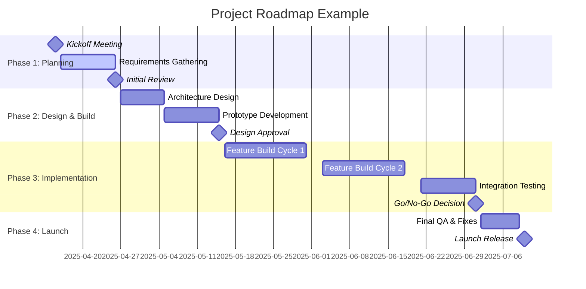

A **Roadmap** is a high-level timeline that depicts such things as milestones, significant events, reviews, and decision points.

It provides a strategic view of work over time, enabling alignment among stakeholders, guiding delivery efforts, and highlighting key objectives and checkpoints across the lifecycle of a project, program, or portfolio.

## Key Characteristics

- **High-Level View** – Focuses on key outcomes rather than detailed tasks  
- **Time-Oriented** – Organized around dates, phases, or iterations  
- **Milestone-Driven** – Includes reviews, approvals, and decision gates  
- **Strategically Aligned** – Communicates intent and direction to stakeholders  

## Example Scenarios

- Outlining quarterly delivery objectives for a digital transformation program  
- Showing major release cycles and product feature launches  
- Mapping strategic initiative phases across multiple departments  

## Example of a Roadmap

## Role in Strategic Planning

- **Improves Visibility** – Aligns teams and leadership on timeline and intent  
- **Supports Decision-Making** – Highlights when input or go/no-go decisions are needed  
- **Enables Progress Tracking** – Serves as a reference for monitoring long-term goals  
- **Facilitates Communication** – Provides a shared visual summary for diverse stakeholders  

See also: [[Milestone]], [[Release Plan]], [[Schedule Baseline]], [[Strategic Alignment]], [[Integrated Master Schedule]].
