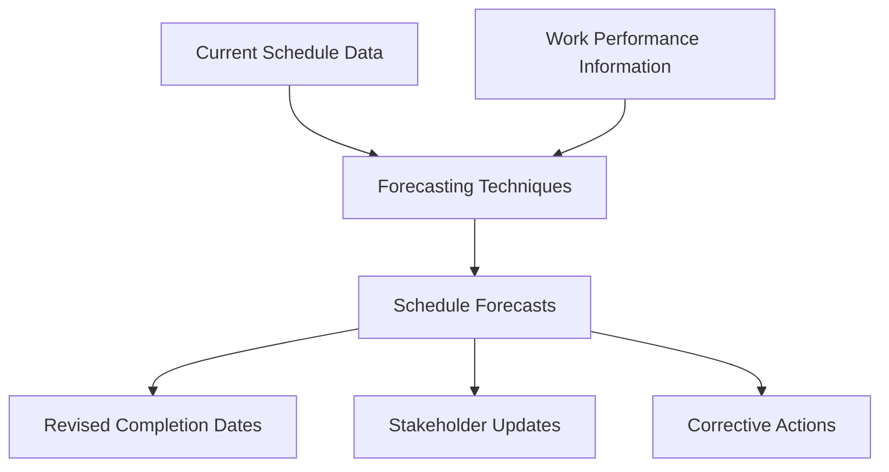

**Schedule Forecasts** are estimates or predictions of conditions and events in the project’s future based on information and knowledge available at the time the schedule is calculated.

They support proactive decision-making by projecting future milestones, identifying potential delays, and estimating the time needed to complete remaining work using actual performance data.

## Key Characteristics

- **Predictive in Nature** – Based on current progress and trends  
- **Supports Schedule Control** – Enables early detection of deviations  
- **Dynamic and Updated Regularly** – Refined as project data evolves  
- **Tied to Earned Value and Performance Metrics** – Often expressed as Estimate to Complete (ETC) or Estimate at Completion (EAC) for time  

## Example Scenarios

- Forecasting project completion based on current task slippage  
- Using SPI (Schedule Performance Index) to estimate new milestone dates  
- Updating schedule forecasts weekly based on reported progress  

### Example of Schedule Forecasting

## Role in Project Time Management

- **Improves Responsiveness** – Allows teams to adapt to potential delays  
- **Strengthens Stakeholder Communication** – Offers forward-looking insights  
- **Supports Integrated Control** – Aligns with scope and cost forecasts  
- **Drives Corrective Actions** – Informs the need for schedule recovery strategies  

See also: [[Schedule Performance Index (SPI)]], [[Estimate to Complete (ETC)]], [[Estimate at Completion (EAC)]], [[Work Performance Information]], [[Schedule Management Plan]].
