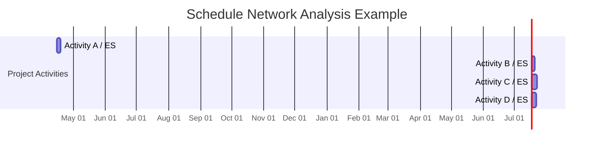

**Schedule Network Analysis** is a technique to identify early and late start dates, as well as early and late finish dates, for the uncompleted portions of project activities.

It is used to evaluate the logical relationships between tasks in a schedule model and to calculate timing flexibility, float, and critical paths—supporting both planning and control decisions.

## Key Characteristics

- **Dependency-Based** – Relies on the sequencing of project activities  
- **Calculates Time Ranges** – Determines early/late start and finish for each task  
- **Enables Critical Path Identification** – Helps locate the path with zero float  
- **Supports Schedule Optimization** – Informs compression, fast tracking, and risk mitigation  

## Example Scenarios

- Performing forward and backward passes to establish activity float  
- Identifying tasks that must start on specific dates to maintain the overall schedule  
- Analyzing the schedule to determine where there is flexibility or risk  

## Example of Schedule Network Analysis

## Sample Schedule Network Analysis Table

| Activity   | Duration | Early Start | Early Finish | Late Start | Late Finish | Total Float |
|------------|----------|-------------|--------------|------------|-------------|-------------|
| Activity A | 4 days   | Apr 15      | Apr 18       | Apr 15     | Apr 18      | 0 days      |
| Activity B | 3 days   | Apr 19      | Apr 21       | Apr 19     | Apr 21      | 0 days      |
| Activity C | 5 days   | Apr 19      | Apr 23       | Apr 21     | Apr 25      | 2 days      |
| Activity D | 4 days   | Apr 24      | Apr 27       | Apr 26     | Apr 29      | 2 days      |

## Role in Schedule Management

- **Improves Schedule Accuracy** – Ensures dates align with logic and constraints  
- **Enables Predictive Control** – Highlights where slippage would affect completion  
- **Supports Compression Techniques** – Identifies candidates for fast tracking or crashing  
- **Feeds Into Forecasting** – Informs updates to ETC and EAC for time  

See also: [[Early Start Date]], [[Early Finish Date]], [[Late Start Date]], [[Late Finish Date]], [[Critical Path Method]].
