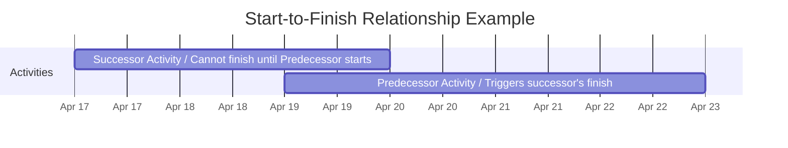

**Start-to-Finish** is a logical relationship in which a successor activity cannot finish until a predecessor activity has started.

This relationship type is rarely used in practice but is useful for modeling constraints such as transitions in responsibilities or handoffs in operational processes, where the completion of one task depends on the initiation of another.

## Key Characteristics

- **Successor Depends on Start of Predecessor** – The finish of the successor is driven by the start of the predecessor  
- **Rarely Applied** – Most project schedules use more common relationships like finish-to-start  
- **Constraint-Oriented** – Often used in complex scheduling or shift-based workflows  
- **Used to Model Delays or Overlaps** – Helpful when planning transitions and readiness scenarios  

## Example Scenarios

- A night shift (successor) cannot end until the day shift (predecessor) begins  
- A legacy system cannot be decommissioned until the replacement system goes live  
- An outgoing manager cannot fully transfer responsibility until the incoming manager starts  

## Example Start-to-Finish Scenario

## Role in Project Scheduling

- **Adds Flexibility to Schedule Modeling** – Useful for unique timing constraints  
- **Requires Precise Logic** – Misuse can cause inaccurate dependencies  
- **Supports Specialized Cases** – Not typically used in standard work packages  
- **Enables Temporal Control** – Useful when timing overlap is mandatory for continuity  

See also: [[Finish-to-Finish]], [[Finish-to-Start]], [[Start-to-Start]], [[Logical Relationship]].
