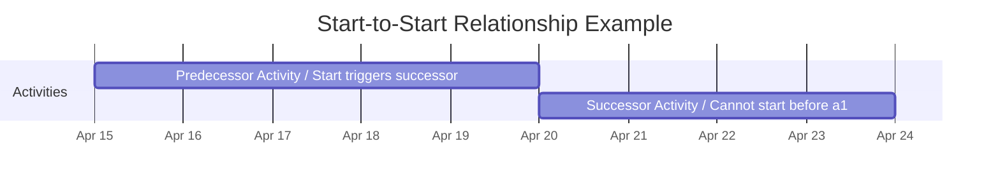

**Start-to-Start** is a logical relationship in which a successor activity cannot start until a predecessor activity has started.

This relationship is used to coordinate activities that must begin in tandem or in close succession, enabling more flexible scheduling and partial parallelism where full dependency is not required.

## Key Characteristics

- **Concurrent Start Trigger** – Successor activity begins once the predecessor has started  
- **Supports Parallel Work** – Allows overlapping effort between related tasks  
- **Useful in Workflow Synchronization** – Ensures timely coordination between tasks  
- **Common in Agile and Iterative Environments** – Supports staggered development or staging  

## Example Scenarios

- Beginning testing as soon as development begins on a module  
- Starting design review sessions after design drafting has started  
- Launching training once system configuration work is underway  

## Example Start-to-Start Scenario

## Role in Project Scheduling

- **Improves Schedule Efficiency** – Reduces idle time between dependent tasks  
- **Supports Flexibility in Planning** – Allows partial overlap of task execution  
- **Used in Detailed Activity Sequencing** – Helps manage resource and time constraints  
- **Enhances Dependency Modeling** – Enables precision in complex workflows  

See also: [[Finish-to-Finish]], [[Finish-to-Start]], [[Start-to-Finish]], [[Logical Relationship]].
