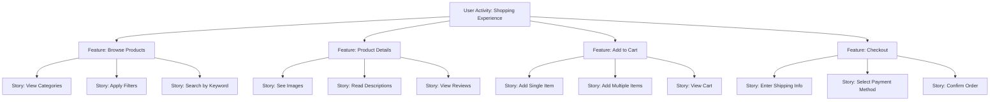

A **Story Map** is a visual model of all the features and functionality desired for a given product, created to give the team a holistic view of what they are building and why.

It organizes user stories based on workflows or activities, allowing teams to prioritize functionality, identify dependencies, and plan releases in a structured, user-centered format.

## Key Characteristics

- **Top-Down Structure** – Starts with user activities, then breaks down into features and stories  
- **User-Centric** – Built around real user needs and goals  
- **Supports Release Planning** – Helps slice the product into meaningful increments  
- **Improves Shared Understanding** – Visualizes the full scope of the product in context  

## Example Scenarios

- Mapping an e-commerce experience from product search to checkout  
- Prioritizing stories for an MVP based on critical user journeys  
- Planning upcoming sprints by release slices drawn from the map  

## Example of a Story Map

## Role in Agile Planning

- **Aligns Team Focus** – Clarifies how stories contribute to user and business value  
- **Facilitates Backlog Refinement** – Helps structure and prioritize stories effectively  
- **Enables Incremental Delivery** – Supports decision-making around scope and sequencing  
- **Enhances Stakeholder Communication** – Offers a high-level visual artifact for alignment  

See also: [[User Story]], [[Product Backlog]], [[Release Planning]], [[Epic]], [[Iteration Planning]].
