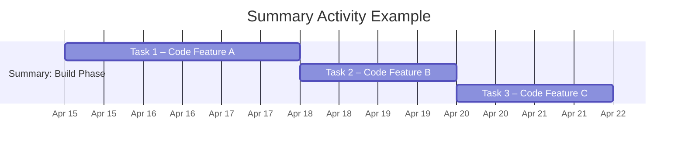

A **Summary Activity** is a group of related schedule activities aggregated and displayed as a single activity.

It represents a roll-up of multiple individual tasks, allowing higher-level visibility into project structure and progress. Summary activities do not have actual durations or dependencies of their own but reflect the combined timing and performance of the detailed activities they encompass.

## Key Characteristics

- **Roll-Up Representation** – Shows the overall duration and status of grouped tasks  
- **Improves Schedule Clarity** – Useful for high-level tracking and reporting  
- **Not Independently Scheduled** – Timing is driven by the start and finish of detailed activities  
- **Supports Hierarchical Planning** – Often aligned with phases, deliverables, or work packages  

## Example Scenarios

- Aggregating design tasks into a “Design Phase” summary activity  
- Grouping all development tasks under a “Build Module A” header  
- Rolling up testing tasks into a “System Testing” milestone view

## Example Summary Activity

## Role in Schedule Modeling and Reporting

- **Enhances Visibility** – Allows stakeholders to view progress at a summary level  
- **Supports Structured Planning** – Tied to the work breakdown structure (WBS)  
- **Facilitates Progress Tracking** – Summarizes completion rates and delays across grouped tasks  
- **Enables Phase Monitoring** – Aligns schedule view with major project milestones  

See also: [[Predecessor Activity]], [[Successor Activity]], [[Work Breakdown Structure]], [[Schedule Model]], [[Gantt Chart]].
