| Knowledge Area             | [Initiating](initiating_process_group.md)                       | [Planning](planning_process_group.md)                                                                                     | [Executing](executing_process_group.md)                                           | [Monitoring & Controlling](monitoring_and_controlling_process_group.md)                                         | [Closing](closing_process_group.md)                |
|---------------------------|--------------------------------|--------------------------------------------------------------------------------------------|----------------------------------------------------|----------------------------------------------------------------|----------------------|
| **[Integration Management](project_integration_management.md)** | - [Develop Project Charter](develop_project_charter.md) | - [Develop Project Management Plan](develop_project_management_plan.md) | - [Direct & Manage Project Work](direct_and_manage_project_work.md)    - [Manage Project Knowledge](manage_project_knowledge.md) | - [Monitor & Control Project Work](monitor_and_control_project_work.md)    - [Perform Integrated Change Control](perform_integrated_change_control.md) | - [Close Project or Phase](close_project_or_phase.md) |
| **[Scope Management](project_scope_management.md)**       |                                | - [Plan Scope Management](plan_scope_management.md)    - [Collect Requirements](collect_requirements.md)    - [Define Scope](define_scope.md)    - [Create WBS](create_wbs.md) |                                                    | - [Validate Scope](validate_scope.md)    - [Control Scope](control_scope.md)                           |                      |
| **[Schedule Management](project_schedule_management.md)**    |                                | - [Plan Schedule Management](plan_schedule_management.md)    - [Define Activities](define_activities.md)    - [Sequence Activities](sequence_activities.md)    - [Estimate Activity Durations](estimate_activity_durations.md)    - [Develop Schedule](develop_schedule.md) | | - [Control Schedule](control_schedule.md) |
| **[Cost Management](project_cost_management.md)**        |                                | - [Plan Cost Management](plan_cost_management.md)    - [Estimate Costs](estimate_costs.md)    - [Determine Budget](determine_budget.md)                                    |                                                    | - [Control Costs](control_costs.md)                                                 |                      |
| **[Quality Management](project_quality_management.md)**     |                                | - [Plan Quality Management](plan_quality_management.md)                                                                  | - [Manage Quality](manage_quality.md)                                     | - [Control Quality](control_quality.md)                                               |                      |
| **[Resource Management](project_resource_management.md)**    |                                | - [Plan Resource Management](plan_resource_management.md)    - [Estimate Activity Resources](estimate_activity.md)                                    | - [Acquire Resources](acquire_resources.md)    - [Develop Team](develop_team.md)    - [Manage Team](manage_team.md)      | - [Control Resources](control_resources.md)                                             |                      |
| **[Communications Management](project_communications_management.md)** |                            | - [Plan Communications Management](plan_communications_management.md)                                                           | - [Manage Communications](manage_communications.md)                              | - [Monitor Communications](monitor_communications.md)                                        |                      |
| **[Risk Management](project_risk_management.md)**        |                                | - [Plan Risk Management](plan_risk_management.md)    - [Identify Risks](identify_risks.md)    - [Perform Qualitative Risk Analysis](perform_qualitative_risk_analysis.md)    - [Perform Quantitative Risk Analysis](perform_quantitative_risk_analysis.md)    - [Plan Risk Responses](plan_risk_responses.md) | - [Implement Risk Responses](implement_risk_responses.md)                           | - [Monitor Risks](monitor_risks.md)                                                 |                      |
| **[Procurement Management](project_procurement_management.md)** |                                | - [Plan Procurement Management](plan_procurement_management.md)                                                              | - [Conduct Procurements](conduct_procurements.md)                               | - [Control Procurements](control_procurements.md)                                          |                      |
| **[Stakeholder Management](project_stakeholder_management.md)** | - [Identify Stakeholders](identify_stakeholders.md)        | - [Plan Stakeholder Engagement](plan_stakeholder_engagement.md)                                                             | - [Manage Stakeholder Engagement](manage_stakeholder_engagement.md)                      | - [Monitor Stakeholder Engagement](monitor_stakeholder_engagement.md)                                |                      |

---

## PMBOK Process Groups and Knowledge Areas

```mermaid
flowchart LR
  A["Process Groups / Knowledge Areas"]

  A --> B["Process Groups"]
  B --> B1["Initiating"]
  B --> B2["Planning"]
  B --> B3["Executing"]
  B --> B4["Monitoring and Controlling"]
  B --> B5["Closing"]

  A --> C["Knowledge Areas"]

  C --> C1["Integration Mgmt"]
  C1 --> C1a["Develop Project Charter"]
  C1 --> C1b["Develop Project Mgmt Plan"]
  C1 --> C1c["Direct and Manage Project Work"]
  C1 --> C1d["Manage Project Knowledge"]
  C1 --> C1e["Monitor and Control Project Work"]
  C1 --> C1f["Perform Integrated Change Control"]
  C1 --> C1g["Close Project or Phase"]

  C --> C2["Scope Mgmt"]
  C2 --> C2a["Plan Scope Mgmt"]
  C2 --> C2b["Collect Requirements"]
  C2 --> C2c["Define Scope"]
  C2 --> C2d["Create WBS"]
  C2 --> C2e["Validate Scope"]
  C2 --> C2f["Control Scope"]

  C --> C3["Schedule Mgmt"]
  C3 --> C3a["Plan Schedule Mgmt"]
  C3 --> C3b["Define Activities"]
  C3 --> C3c["Sequence Activities"]
  C3 --> C3d["Estimate Activity Durations"]
  C3 --> C3e["Develop Schedule"]
  C3 --> C3f["Control Schedule"]

  C --> C4["Cost Mgmt"]
  C4 --> C4a["Plan Cost Mgmt"]
  C4 --> C4b["Estimate Costs"]
  C4 --> C4c["Determine Budget"]
  C4 --> C4d["Control Costs"]

  C --> C5["Quality Mgmt"]
  C5 --> C5a["Plan Quality Mgmt"]
  C5 --> C5b["Manage Quality"]
  C5 --> C5c["Control Quality"]

  C --> C6["Resource Mgmt"]
  C6 --> C6a["Plan Resource Mgmt"]
  C6 --> C6b["Estimate Activity Resources"]
  C6 --> C6c["Acquire Resources"]
  C6 --> C6d["Develop Team"]
  C6 --> C6e["Manage Team"]
  C6 --> C6f["Control Resources"]

  C --> C7["Communications Mgmt"]
  C7 --> C7a["Plan Communications Mgmt"]
  C7 --> C7b["Manage Communications"]
  C7 --> C7c["Monitor Communications"]

  C --> C8["Risk Mgmt"]
  C8 --> C8a["Plan Risk Mgmt"]
  C8 --> C8b["Identify Risks"]
  C8 --> C8c["Perform Qualitative Risk Analysis"]
  C8 --> C8d["Perform Quantitative Risk Analysis"]
  C8 --> C8e["Plan Risk Responses"]
  C8 --> C8f["Implement Risk Responses"]
  C8 --> C8g["Monitor Risks"]

  C --> C9["Procurement Mgmt"]
  C9 --> C9a["Plan Procurement Mgmt"]
  C9 --> C9b["Conduct Procurements"]
  C9 --> C9c["Control Procurements"]

  C --> C10["Stakeholder Mgmt"]
  C10 --> C10a["Identify Stakeholders"]
  C10 --> C10b["Plan Stakeholder Engagement"]
  C10 --> C10c["Manage Stakeholder Engagement"]
  C10 --> C10d["Monitor Stakeholder Engagement"]
```

  
Click to expand full flow chart

 
